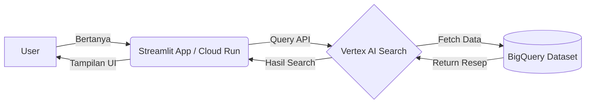

# 🍳 Chef Bot - AI Recipe Assistant


**Chef Bot** adalah asisten pencarian resep pintar yang dibangun menggunakan **Retrieval-Augmented Generation (RAG)** sederhana di Google Cloud Platform. Aplikasi ini memanfaatkan kekuatan **Vertex AI Search** untuk memahami pertanyaan pengguna dan mencari resep yang relevan dari **BigQuery**, lalu menampilkannya melalui antarmuka web yang bersih menggunakan **Streamlit**.

---

## 🏗️ Arsitektur & Teknologi

Project ini mengintegrasikan beberapa layanan *enterprise-grade* dari Google Cloud:



  * **🐍 Python & Streamlit:** Frontend aplikasi yang interaktif dan *mobile-friendly*.
  * **🔍 Vertex AI Search (Agent Builder):** "Otak" pencarian yang mengindeks data dan memproses *natural language query*.
  * **🗄️ BigQuery:** Data Warehouse tempat menyimpan *dataset* resep secara terstruktur.
  * **🚀 Cloud Run:** Platform *serverless* untuk men-deploy aplikasi container secara instan dan *scalable*.

-----

## 📂 Struktur Project

```text
vertex-ai-recipe-chatbot/
├── home.py              # Main Application (Streamlit + Vertex AI Logic)
├── setup_bigquery.py    # Script untuk upload data dummy ke BigQuery
├── Dockerfile           # Konfigurasi Container untuk Cloud Run
├── requirements.txt     # Daftar library Python yang dibutuhkan
└── README.md            # Dokumentasi Project
```

-----

## 🚀 Tutorial & Cara Replikasi

Ingin mencoba membuat sendiri? Berikut adalah langkah-langkahnya:

### 1\. Persiapan Data (BigQuery)

Pertama, kita perlu memasukkan data resep ke dalam BigQuery. Jalankan script `setup_bigquery.py` di lingkungan lokal atau Cloud Shell.

```python
# Script ini akan membuat Dataset 'recipe_data' dan Tabel 'recipes'
# serta mengupload sampel data resep (Nasi Goreng, Sate, Gado-gado).
python setup_bigquery.py
```

### 2\. Konfigurasi Vertex AI Search

Masuk ke Google Cloud Console dan buka **Agent Builder**:

1.  Buat **Data Store** baru.
2.  Pilih sumber **BigQuery** dan arahkan ke tabel `recipe_data.recipes` yang baru dibuat.
3.  Buat **App** baru bertipe "Search".
4.  Aktifkan fitur **Enterprise Edition** dan set lokasi ke **Global**.
5.  Hubungkan App dengan Data Store tadi.

### 3\. Deploy ke Cloud Run

Kita menggunakan Cloud Run agar aplikasi bisa diakses publik tanpa memikirkan server.

**Langkah 1: Clone Repository**

```bash
git clone https://github.com/Leuthra/vertex-ai-recipe-chatbot.git
cd vertex-ai-recipe-chatbot
```

**Langkah 2: Deploy**
Jalankan perintah berikut di Cloud Shell (Google Cloud SDK):

```bash
gcloud run deploy aplikasi-resep \
  --source . \
  --region us-central1 \
  --allow-unauthenticated \
  --port=8501
```

*Catatan: `--port=8501` penting karena Streamlit berjalan di port tersebut secara default.*

### 4\. Selesai\! 🎉

Buka URL yang diberikan oleh Cloud Run, dan Chef Bot siap melayani pertanyaan resep kamu\!

-----

## 📸 Preview

*Contoh hasil pencarian "Nasi Goreng" yang menampilkan bahan dan cara memasak secara lengkap.*


-----

## 🤝 Kontribusi

Project ini dibuat sebagai materi pembelajaran/workshop. Pull request untuk perbaikan atau penambahan fitur sangat diterima\!

-----